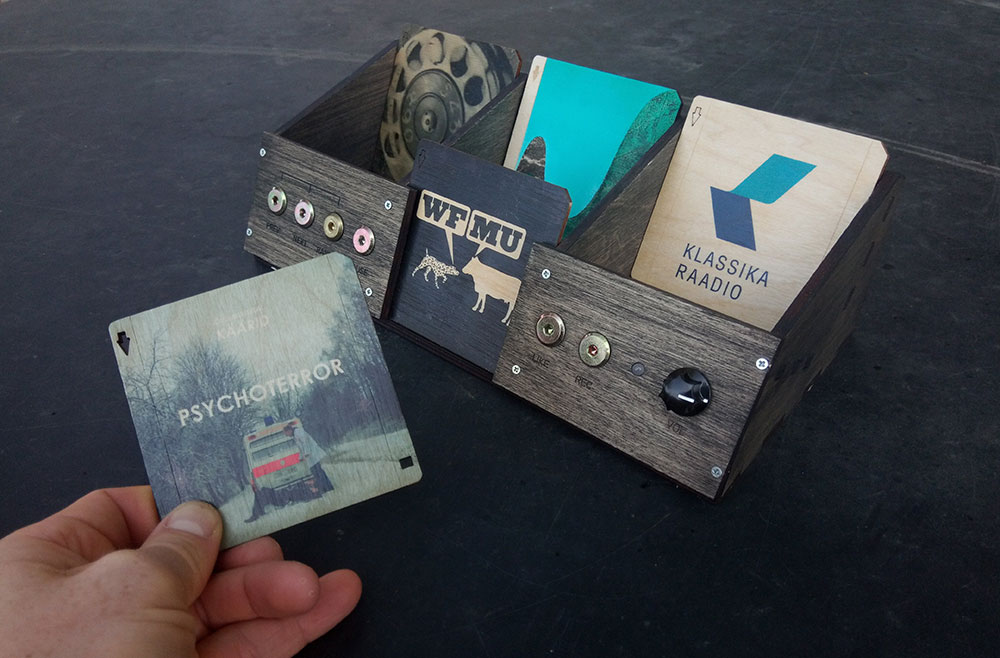

# Linki Drive

Media player controller for Home Assistant based on ESP32 and PN532 NFC tag reader.

Linki Drive is a media player controller for Linkis. Linki is an open format that specifies the size, shape and position of NFC tag to be usable across different media player usage.

[Website of the Linki project](https://www.linki.cc)
